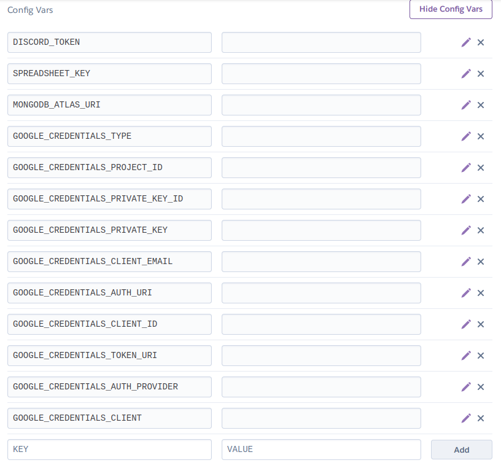
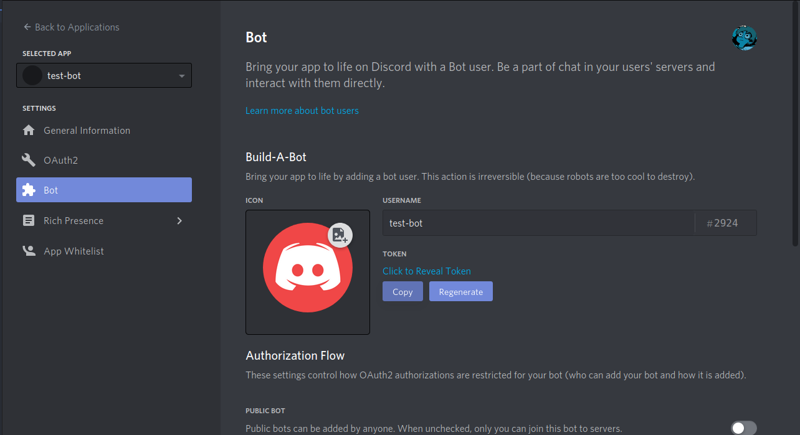
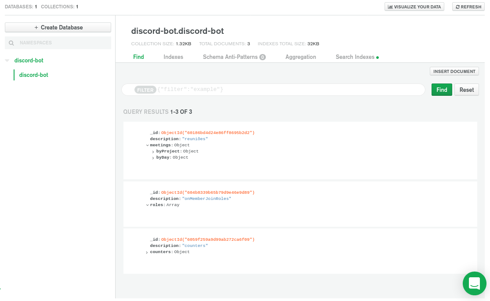
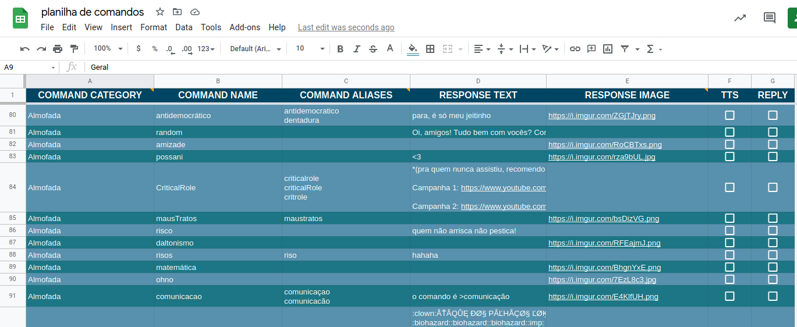
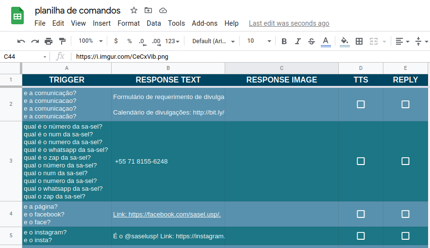
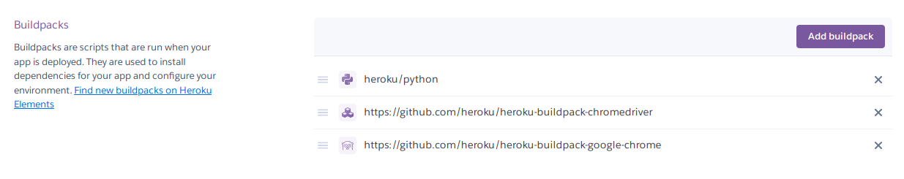

# Discord Chatbot

Simple bot that'll reply to commands (prefix '>') and on_message() triggers specified in a Google Sheets.
The spreadsheet must have two worksheets named "triggers" and "commands", respectively.

The code is kinda chaotic and not too well commented. Sorry.

## Config

You must provide your own Google Sheets API's credentials variables as well as your Discord token, spreadsheet key and MongoDB Atlas URI. The data may be provided as a `credentials.json` and `.env` on the project's root directory or as Heroku config variables (if you're hosting in Heroku, see image below).

If you don't know how to get Google's API credentials, I recommend [this video](https://www.youtube.com/watch?v=cnPlKLEGR7E).

The `.env` file should be as follows:

```
DISCORD_TOKEN =
SPREADSHEET_KEY =
MONGODB_ATLAS_URI =
```

Heroku's config variables should be set as follows:



### DISCORD_TOKEN

You must create a discord application in [here](https://discord.com/developers/applications/) and a bot inside it. The token needed is the bot's one, that can be found in https://discord.com/developers/applications/<APPLICATION ID\>/bot - as can be seen in the image below.



### SPREADSHEET_KEY

Get it from the spreadsheet's link: https://docs.google.com/spreadsheets/d/<SPREADSHEET_KEY>. You must share the spreadsheet with your bot's email (from the Google Sheets API, it should be specified in your `credentials.json`).

### MONGODB_ATLAS_URI

Some commands I implemented - like the ones to track meetings and that use counters - depend on a database, for which I used MongoDB, specifically Mongo Atlas. For it to work right away, you just need to create a cluster of your own, put the connection URI in the `.env` and create in it a cluter, a database and a collection, all of them named `discord-bot`.

Inside the database, create three objects as in the images below - `byProject` and `byDay` being empty objects, `roles` being an empty array, and counters being an object in which the keys are the names of the commands in the Counters.py cog and the values are any int number.



## Google Sheet

The spreadsheet must have a sheet named `commands` and a sheet named `triggers` with the specifications below.

### Commands' worksheet

It must have the following columns:

- "COMMAND CATEGORY"
  - All commands of a same category must be adjacent, otherwise only the last "block" will be used.
  "COMMAND NAME"
  - Can't contain special characters nor whitespace.
- "COMMAND ALIASES"
  - Multiple aliases should be separated by a linebreak;
  - Do not include the command name.
- "RESPONSE TEXT" - the reply's text content
- "RESPONSE IMAGE"
  - Public links to the reply's image contents
  - Maximum of 10 images, separeted by linebreaks;
  - The links should take directly to the images
- "TTS" - if that command should be read by discord's _text-to-speech_
- "REPLY" - if the response should be sent as a reply



### Triggers' worksheet

It must have the following columns:

- "TRIGGER" - message content that'll trigger the reply below
  - Write it in lowercase - detection is not case-sensitive;
  - Multiple triggers should be separated by a linebreak (Alt + Enter).
- "RESPONSE TEXT"
- "RESPONSE IMAGE"
- "TTS" - if that command should be read by discord's _text-to-speech_
- "REPLY" - if the response should be sent as a reply



## Hosting

It was designed to be in a Heroku dyno, but you may do it however you prefer.

The `>codenames` command uses Selenium and to make it work with Heroku, you must add the following buildpacks to your app.



If you are hosting outside Heroku, you may need to comment out the SuperMarselo.py cog's 17th line and integrate a Chrome webdriver to the code manually.
