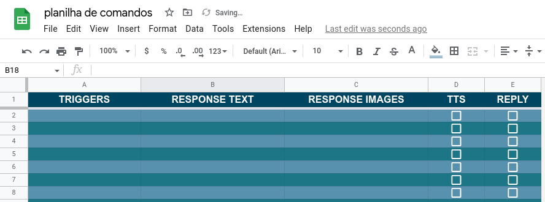

# "A Voz da SA-SEL" - Discord Bot

Bot developed as a tool for SA-SEL's Discord server.

## Executing

1.  `git clone git@github.com:sa-sel/discord-bot.git`
2.  `cd /path/to/discord-bot/`
3.  `pip install -r requirements.txt`
4.  Provide your [config](#config)
5.  `python src/main.py`

## <a id="config"></a> Config

You must provide your own Google Sheets API's credentials variables (or file) as well as your Discord token, spreadsheet key and MongoDB Atlas URI. The data may be provided as a `credentials.json` and `.env` on the project's root directory or as Heroku config variables (if you're hosting in Heroku, see image below).

If you don't know how to get Google's API credentials, watch [this video](https://www.youtube.com/watch?v=cnPlKLEGR7E).

The `.env` file should be as follows:

```
DISCORD_TOKEN =
SPREADSHEET_KEY =
MONGODB_ATLAS_URI =
```

Heroku's config variables should be set as follows:


### DISCORD_TOKEN

You must create a discord application in [here](https://discord.com/developers/applications/) and a bot inside it. The token needed is the bot's token, not the application's - it can be found in **https://discord.com/developers/applications/<APPLICATION ID\>/bot**, as can be seen in the image below.


### SPREADSHEET_KEY

Get it from the spreadsheet's link: **https://docs.google.com/spreadsheets/d/<SPREADSHEET_KEY>**. You must share the spreadsheet with your bot's email (from the Google Sheets API, it should be specified in your `credentials.json`).

## Contributing

### Linting

We're mainly using `pydocstyle` and `flake8` for linting. Download and configure their extensions/enable their functionality in your IDE - e.g.: for VSCode, see [this video](https://www.youtube.com/watch?v=eMIxokGhFHM).

### Formatting

We're using `black` and `isort` for autoformatting. Download and integrate them to your IDE - e.g.: for VSCode, see [this post](https://cereblanco.medium.com/setup-black-and-isort-in-vscode-514804590bf9). Important, do not add custom args to `black`.

### Commit messages

Write commit messages following this [style guide](https://commit.style/) and be sure to make use of `git commit --amend` and `--no-edit` when necessary. Write commit message that actually describe (summarize) the changes you made - do not commit stuff like `Fix bug`, `Fix`, `Fix bug 3`, `Fix bug (again)`.

Aside from that, start all your commit messages with `#<TASK_NUMBER> - `. e.g., when working on the task `#7`, you commit the creation of the `>choose` command: `#7 - Create >choose`.

### Workflow

1.  Clone the repo
2.  Choose a task to work on in the [board](https://github.com/orgs/sa-sel/projects/2)
    - The task must be in the 'To do' column and without assignees
    - Cheque se a _task_ sem alguma dependência e, se sim, se elas já foram concluídas
    - Give preference to tasks with higher priority
3.  Assign the task to yourself and move it to the 'In dev' column
4.  Create a new branch from `dev` (new branch's name should follow the pattern `task-<TASK_NUMBER>`)
5.  Make all your changes in this new branch
6.  Merge the `dev` branch into yours
    1. `git fetch --all`
    2. `git merge origin dev`
    3. Resolve all the merge conflicts
    4. `git commit` (keep the default commit message)
7.  `git push --set-upstream origin task-<TASK_NUMBER>`
8. Make a PR to `dev` and move the task to the 'Waiting merge' column
    1. Your PR's title should be `#<TASK_NUMBER> - <TASK_NAME>`
9. Only merge your PR when:
    1. It has at least two approves
    2. All builds were successful
    3. There's no merge conflicts

## Google Sheets

The spreadsheet must have a sheet named `commands` and a sheet named `triggers` with the specifications below.

### Commands' worksheet

It must have the following columns:

- **COMMAND CATEGORY**
- **COMMAND NAME** - can't contain whitespace
- **COMMAND ALIASES**
  - Multiple aliases should be separated by a linebreak (Alt + Enter);
  - Do not include the command name.
- **RESPONSE TEXT** - the reply's text content
- **RESPONSE IMAGE**
  - Public links to the reply's image contents;
  - Maximum of 10 images, separeted by linebreaks;
  - The links should go directly to the images.
- **TTS** - if that command should be read by discord's _text-to-speech_
- **REPLY** - if the response should be sent as a reply rather than a normal message


### Triggers' worksheet

It must have the following columns:

- **TRIGGER**
  - Message content that will trigger the reply;
  - Not case-sensitive;
  - Multiple triggers should be separated by a linebreak.
- **RESPONSE TEXT**
- **RESPONSE IMAGE**
- **TTS**
- **REPLY**



## Hosting

It was designed to be in a Heroku dyno, but you may do it however you prefer.

The `>codenames` command uses Selenium and to make it work with Heroku, you must add the following buildpacks to your app.


